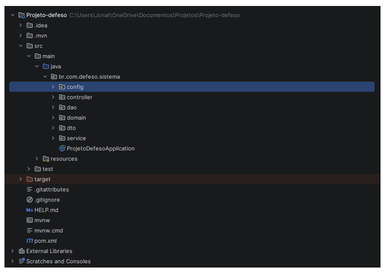

<div align="center">

# 🌊 ECOSIS

### Plataforma Web para Gestão e Análise do Período de Defeso

Sistema desenvolvido utilizando **Java**, **Spring Boot** e **MySQL**, com foco em gerenciamento de informações, modelagem de banco de dados e automação de processos por meio de SQL, Procedures, Triggers e Views.

<p align="center">


</p>

</div>

---

# 🎥 Demonstração

<p align="center">

<a href="./img/video do projeto.mp4">


</a>

</p>

> Clique na imagem acima para assistir à demonstração completa do sistema.

---

# 📖 Sobre o Projeto

O **ECOSIS** é uma plataforma web desenvolvida para centralizar o gerenciamento de informações relacionadas ao período de defeso.

O sistema possui uma área pública destinada à divulgação de conteúdos educativos, notícias e informações aos usuários, além de um painel administrativo responsável pelo gerenciamento das principais funcionalidades da aplicação.

Durante o desenvolvimento foi dada grande ênfase à **organização dos dados**, **modelagem de banco de dados** e utilização de recursos avançados do MySQL para automatizar processos e garantir maior integridade das informações.

Mais do que desenvolver uma aplicação web, o objetivo foi construir um sistema organizado, escalável e com forte integração entre a aplicação e o banco de dados.

---

# ✨ Principais Funcionalidades

## 🌐 Área Pública

- Página inicial institucional
- Direitos relacionados ao período de defeso
- Notícias
- Conteúdo educativo
- Informações ao cidadão

---

## 👨‍💼 Painel Administrativo

- Dashboard
- Monitoramento de Fauna
- Sistema de Pesquisas
- Central de Feedbacks
- Simulação de Benefícios
- Gerenciamento de Usuários
- Relatórios
- Logs do Sistema

---

# 🗄 Banco de Dados

Um dos principais diferenciais do projeto é a utilização de recursos avançados de banco de dados.

Foram aplicados conceitos como:

- Modelagem Relacional
- SQL
- Procedures
- Triggers
- Views
- Relacionamentos entre tabelas
- Integridade Referencial
- Auditoria de Dados
- Organização lógica das informações
- Consultas otimizadas
- Relatórios baseados nos dados armazenados

---

## Procedures

Utilizadas para automatização de regras de negócio, reduzindo processamento na aplicação e aumentando a reutilização das operações.

---

## Triggers

Responsáveis pela auditoria automática de registros e execução de processos durante inserções, atualizações e exclusões.

---

## Views

Criadas para simplificar consultas complexas e disponibilizar informações organizadas para utilização pelo sistema.

---

# 🛠 Tecnologias Utilizadas

## 💻 Back-end

- Java
- Spring Boot
- Spring MVC
- Spring Security
- Spring Data JPA
- Hibernate

---

## 🗄 Banco de Dados

- MySQL
- SQL
- Procedures
- Triggers
- Views
- Modelagem Relacional

---

## 🎨 Front-end

- Thymeleaf
- HTML
- CSS
- Bootstrap
- JavaScript

---

## 🧰 Ferramentas

- IntelliJ IDEA
- MySQL Workbench
- Git
- GitHub

---

# 🏛 Arquitetura

O projeto foi desenvolvido seguindo a arquitetura **MVC (Model-View-Controller)**, promovendo separação de responsabilidades entre as camadas da aplicação.

Além disso, foram utilizados diagramas UML para planejamento da estrutura da aplicação.

---

---

# 📂 Estrutura do Projeto

O projeto foi organizado em camadas seguindo boas práticas de desenvolvimento com **Spring Boot**, utilizando uma arquitetura baseada em **MVC**, promovendo baixo acoplamento e melhor organização do código-fonte.

<p align="center">
  
</p>

---

## 📊 Dashboard Administrativo

Gerenciamento central das funcionalidades do sistema.

<p align="center">

</p>

---

## 🐟 Monitoramento de Fauna

Cadastro e gerenciamento das espécies monitoradas.

<p align="center">

</p>

---

## 📝 Sistema de Pesquisas

Gerenciamento de pesquisas e armazenamento estruturado das respostas.

<p align="center">

</p>

---

## 💬 Central de Feedbacks

Registro, classificação e gerenciamento dos feedbacks enviados pelos usuários.

<p align="center">

</p>

---

## 📈 Simulação de Benefícios

Simulação do Seguro-Defeso e gerenciamento das solicitações.

<p align="center">

</p>

---

## 🏠 Página Inicial

Interface pública destinada à divulgação de informações relacionadas ao período de defeso.

<p align="center">

</p>

---

## ⚖️ Direitos do Pescador

Página com informações sobre direitos, benefícios e requisitos para acesso ao Seguro-Defeso.

<p align="center">

</p>

---

## 🌱 Educação Ambiental

Conteúdo educativo voltado à preservação ambiental e conscientização sobre o período de defeso.

<p align="center">

</p>

---

# 🗂 Modelagem do Banco de Dados

O banco foi desenvolvido utilizando modelagem relacional, priorizando organização, integridade e escalabilidade.

## Modelo Entidade-Relacionamento (DER)

<p align="center">

</p>

---

# 📐 Diagrama UML

Modelagem da estrutura da aplicação e relacionamento entre as principais classes.

<p align="center">

</p>

---

# 🚀 Como Executar

```bash
git clone https://github.com/SEU_USUARIO/ECOSIS.git
```

Configure o banco de dados MySQL.

```properties
spring.datasource.url=

spring.datasource.username=

spring.datasource.password=
```

Execute a aplicação utilizando sua IDE de preferência ou via Maven.

---

# 📈 Roadmap

- [x] Área Pública
- [x] Dashboard Administrativo
- [x] Sistema de Pesquisas
- [x] Monitoramento de Fauna
- [x] Central de Feedbacks
- [x] Simulação de Benefícios
- [x] Relatórios
- [x] Procedures
- [x] Triggers
- [x] Views
- [x] Spring Security
- [ ] Dashboard Analítico
- [ ] Exportação de Relatórios
- [ ] Docker
- [ ] Deploy
- [ ] API REST

---

# 👥 Equipe

- Jonatas Gabriel Costa Santos
- Equipe do Projeto ECOSIS

---

# 📚 Objetivo

O principal objetivo deste projeto foi aplicar conhecimentos de desenvolvimento de software e banco de dados em uma aplicação que ultrapassasse um CRUD tradicional.

Durante o desenvolvimento foram aplicados conceitos relacionados à arquitetura de software, organização de código, segurança, banco de dados relacional, SQL, modelagem, automação de processos e gerenciamento de informações.

Além do desenvolvimento da aplicação, o projeto serviu como ambiente de estudo para aprofundamento em tecnologias utilizadas no desenvolvimento back-end e na área de Banco de Dados, reforçando competências importantes para projetos voltados à Engenharia de Software, Banco de Dados, Business Intelligence e Engenharia de Dados.

---

# 📄 Licença

Projeto desenvolvido para fins acadêmicos e de portfólio.

---

<div align="center">


</div>
